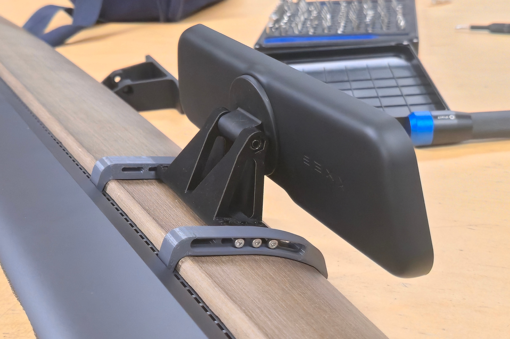

# S3XY Dash Mount

### Intro
This is a alternative way to mount the S3XY Dash from Enhance directly behind the steeringwheel to the trim without gluing/taping.

It clips and hooks onto the trim and is adjusable using screws.

I designed it for my Model 3 facelift (2021-2022), but it should also be compatible with the pre facelift Model 3 (2017-2020) and the Model Y pre Juniper (2021-2023).

The brackets and the Mount itself have slotted holes, so it can be acjustet in position forward, backward and also a bit up and down.
In my case i am also able to see the S3XY Strip above the S3XY Dash. I like that very much.

### Prerequisites
- The original S3XY Dash Mount. We need the magnetic plate and the screw + nut from it.
- beeing able to remove/install the trim from the car, just in case.
  Watch the video from Enhance. ;-)
- a 3D Printer and Material that withstands >70°C.
PETG is a bad choice, I can tell. PC (PolyCarbonate) works well.
- 2x 10cm self-adhesive foam rupper strip, 3mm thick, 3mm - 13mm wide
- Screws:
 - 4x M3x12mm cylinder head hex socket
 - 4x M3 flap disk
 - 4x M3 washer
 - 4x M3 spring washer
 - 4x M3 nut
 - 2x M5 flap washer
You can use als six screws, like on the pictures, but it may not fit in every position with the slotted holes.

### How To
1. print the parts
I have printed them sucessfully in PC, 0,4mm nozzle, 0,2mm layerhight, 50% Infill on an Prusa Core 1L.
The brackets laying on the side with support, the mout itseld standing up, completely without support.
2. put the foam rupper strips on the inside of the brackets, so it will be later around the trim, to avoid rattling.
3. Put in all the screws, but let them loose. Put the flap disk between the mount and its brackets.
4. put the mount centered behind the steeringwhell. First with the wide hook at the front bottom of the trim and as second the rear clips into the air vents.
5. to remove the brackets again, i recommend to remove the trim aut of the car and push the rear clips of the brackets back through the vent.
6. now you can calign the mount and tighten the screws.
